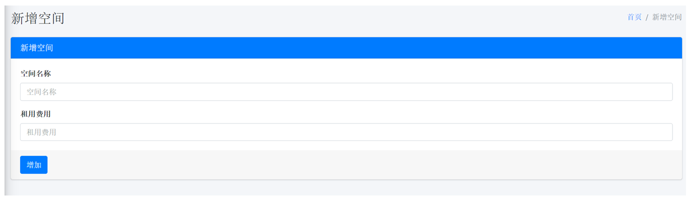
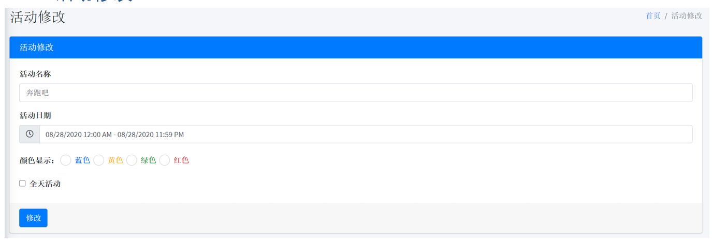

# 空间租用系统 (Space Rental System)

[](LICENSE)
[](https://www.python.org)
[](https://www.djangoproject.com)

> 🎉 现已开源！一个功能完善的空间租用管理系统，支持场地预订、活动管理和用户管理。

## 📢 重要通知

本项目从商业版本转为开源版本。开源版本保留了所有核心功能，并进行了以下优化：
- 完善的文档支持
- 更好的代码组织
- 移除了商业版本特定的依赖
- 添加示例数据便于快速启动

## ✨ 特性

- 🔐 完善的权限管理系统
- 📅 直观的日历预订界面
- 🚀 Redis缓存支持
- 📊 空间使用统计
- 👥 多角色用户管理
- 🔒 安全的认证机制

## 技术栈

- Backend Framework: Django
- ORM: Django ORM + SQLAlchemy
- Cache: Redis
- Architecture: MVT (Model-View-Template)
- Security: Django CSRF Protection
- Database: MySQL 5.7+

## 🚀 快速开始

### 环境要求

- Python 3.7+
- MySQL 5.7+
- Redis 5.0+
- Django 3.2+
- SQLAlchemy 1.4+

### 部署信息

#### 数据库配置
- HOST：127.0.0.1:3306
- User: root
- Password: root
- Database: space_rent

#### Redis配置
- HOST: 127.0.0.1
- PORT: 6379
- DB: 0

#### 本地开发环境
- 地址：http://127.0.0.1:8000/
- 管理员账号：
  - 账号：admin
  - 密码：admin123
- 测试用户账号：
  - 账号：lyy123
  - 密码：lyy123456

### 部署步骤

1. 安装依赖
```bash
pip install -r requirements.txt
```

2. 配置数据库
```bash
python manage.py migrate
```

3. 创建超级用户
```bash
python manage.py createsuperuser
```

4. 启动服务
```bash
python manage.py runserver
```

## 登入界面


## APP首页，空间预定预览表


- 用户可查询个人资料
- 用户可修改密码
- 用户可退出当前登入账号

## 用户个人资料


- 用户可查看和编辑个人资料

## 修改个人密码


- 用户所修改的密码会进行安全加密

## 预定空间


1. 用户选择要预定的空间及空间租用日期


2. 若用户空间增加失败，说明不能预定已经过去的时间或是空间状态关闭时

## 空间预定记录


- 用户空间预定后显示以下信息：
  - 租用的空间名称
  - 租用日期/时间
  - 费用
  - 状态
  - 操作选择
- 状态：
  - 已办理/取消：用户不可更改任何操作
  - 编辑：可修改当前预定的日期/时间
  - 取消：可取消预定，取消后保留记录

## 用户修改预定空间


- 预定状态在待处理时，用户可修改空间预定的日期

## 新增空间



- 管理员可新增可租用的空间及空间租用费用


- 若增加空间时出现增加失败，说明有空间名称重叠，空间已存在

## 空间预定管理


- 空间新增后，可管理当前空间是否允许租借
- 状态：
  - 启用：用户可租借当前的空间
  - 关闭：用户不可租借当前的空间
  - 启用/关闭：设置空间租用的状态
  - 删除：可删除当前空间，不影响之前用户租借空间的记录
- 若是空间状态关闭时，用户租用空间界面不会显示已被关闭的空间

## 新增活动


- 管理员可增加活动，所有成功增加的活动会显示在首页一览表的日历内
- 用户可查询到相关活动
- 可以选择要突出的颜色：蓝色、黄色、绿色、红色


- 若打勾全天活动，则不受活动时间的影响

## 活动管理


- 管理员可管理安排好的活动
- 操作：
  - 显示：活动显示在首页日历一览表
  - 不显示：活动不显示在首页日历一览表
  - 编辑：可以修改活动名称、日期、颜色
  - 显示/不显示：设置活动的状态
  - 删除：可删除当前活动，不影响之前的活动记录

## 活动修改



- 管理员可编辑活动信息

## 用户空间预定管理


- 所有用户预定空间的记录都会显示在这里
- 管理员可进行用户空间预定的管理
- 点击预定用户的名字，可以直接查询当前用户的所有资料
- 状态：
  - 待处理：表示未处理
  - 已办理：表示已处理
  - 已取消：表示已取消
  - 取消：可以取消用户预定的空间，用户不得进行修改操作
  - 成功：状态标记为已处理，用户不得进行修改操作
  - 删除：可删除当前用户预定空间的记录

## 用户管理


- 管理员可查询及修改所有用户的个人资料，包括密码修改
- 状态：
  - 活跃：用户可登入系统
  - 不活跃：暂停用户登入系统
  - 详细：点击后可查询用户相关资料进行管理

## 用户资料


- 点击详细后，会来到用户资料页面
- 左下角可以点击编辑进行修改用户资料操作

## 用户资料修改


- 若不修改用户密码，可放空
- 权限：
  - Standard：用户基本面的功能（预定空间等）
  - Administrator：支持所有功能
- 若永久删除用户，用户的所有资料会消失，包括之前用户预定的空间记录

## 新增用户

- 增加新用户账号

## 🤝 贡献指南

我们欢迎所有形式的贡献，无论是新功能、bug修复还是文档改进！

1. Fork 本仓库
2. 创建新的分支: `git checkout -b feature/your-feature`
3. 提交更改: `git commit -am 'feat: add some feature'`
4. 推送到分支: `git push origin feature/your-feature`
5. 提交 Pull Request

请确保您的 PR 描述清晰，并遵循我们的代码规范。

## 📝 版本日志

- V2.0.1 (2020-08-27)
  - 🎉 开源版本发布
  - ✨ 增加Redis Log缓存支持
  - 🔧 优化数据库查询性能

## 📄 开源协议

本项目采用 MIT 协议。查看 [LICENSE](LICENSE) 获取更多信息。

## ⭐ Star 历史

[](https://star-history.com/#yenyoong99/SpaceRental_System&Date)
